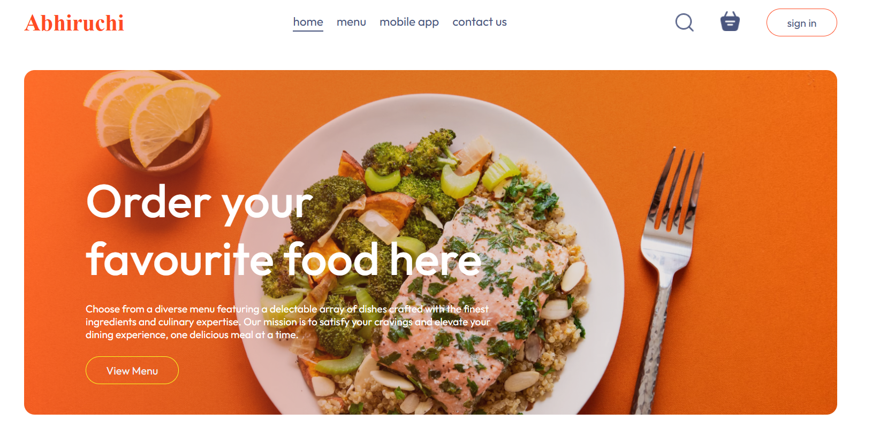

# Food Delivery App

Welcome to the frontend of the Food Delivery App! This app allows users to browse local restaurants, place orders, and track deliveries. It communicates with a backend API to handle all data interactions, including ordering and user authentication.

## Preview my Application
Please have a look into my application and make a review to learn more from others and implement more features
https://abhiruchi-food-app.netlify.app/

## Features

- **User Registration & Authentication**: Secure login and sign-up functionality.
- **Restaurant Listings**: Display a list of available restaurants and their menus.
- **Menu Display**: Show detailed menu items, including prices, descriptions, and images.
- **Order Customization**: Allow users to customize their orders (e.g., toppings, ingredients).
- **Real-Time Order Tracking**: Track order status and estimated delivery time.
- **Ratings & Reviews**: Let users rate and review restaurants and dishes.
- **Push Notifications**: Notify users about order updates or new promotions.
- **Responsive Design**: Optimized for both mobile and web platforms.

## Technology Stack

- **Frontend Framework**: React 
- **State Management**: Redux (or React Context API)
- **Styling**: CSS / Styled Components / Tailwind CSS (depends on your choice)
- **Routing**: React Router (for web)
- **API Communication**: Axios / Fetch API
- **Authentication**: JWT (through backend)
- **Push Notifications**: Firebase Cloud Messaging (optional)

## Screenshot



## Installation

### Prerequisites

Before starting, ensure you have these tools installed:

- **Node.js** and **npm** (or Yarn)
- **React Native** (for mobile) or a web development environment (for React)

### Clone the Repository

1. Clone the repository to your local machine:

   ```bash
   git clone https://github.com/yourusername/food-delivery-app-frontend.git
2. Navigate into the project directory:

   ```bash
   cd Abhiruchi-Food-App

3. Install the required dependencies:

   ```bash
   npm install

4. Start the development server:

   ```bash
   npm run dev

## Usage
1. Sign Up/Login: Create a new account or sign in if you already have one.
2. Browse Restaurants: Explore a list of restaurants in your area.
3. View Menu: Select a restaurant and view their menu items.
4. Place an Order: Add items to your cart, customize your order, and proceed to checkout.
5. Track Your Order: View the status of your order as it moves from preparation to delivery.
6. Leave a Review: Rate the restaurant or dishes you've tried.


## Contributing
We welcome contributions from the community! If you want to contribute, please follow these steps:

- Fork the repository.
- Create a new branch (git checkout -b feature-branch).
- Make your changes and commit them (git commit -am 'Add new feature').
- Push to the branch (git push origin feature-branch).
- Open a pull request.

  
## License
This project is licensed under the MIT License - see the LICENSE file for details.
